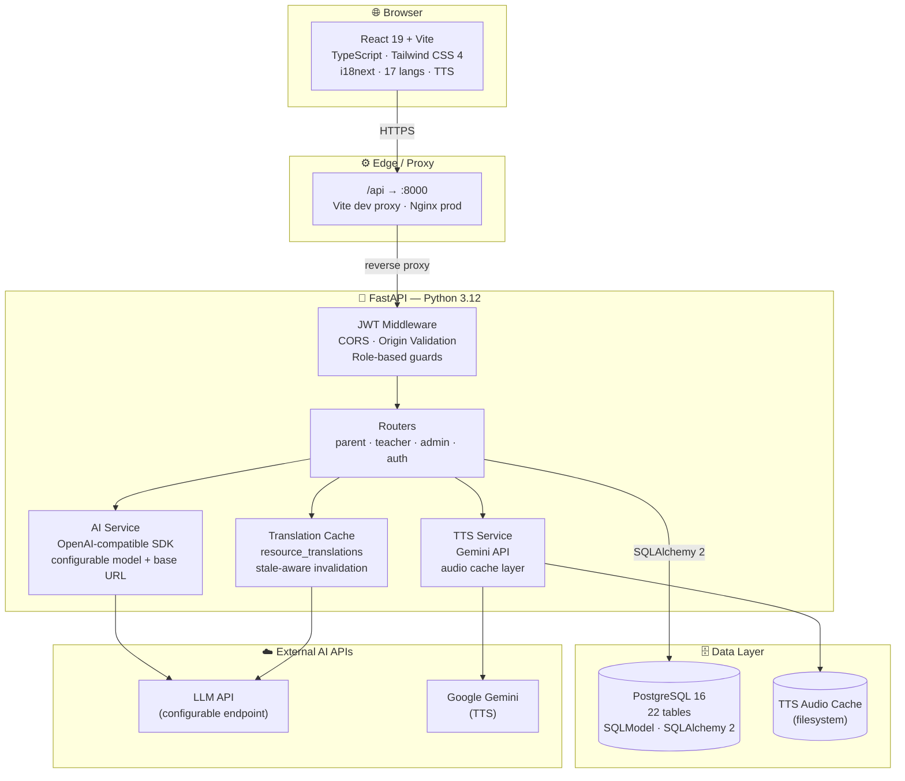
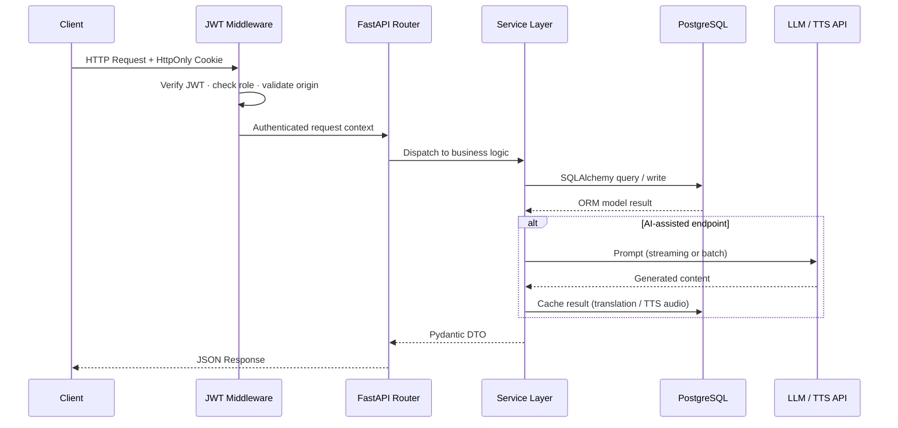

<!-- ╔══════════════════════════════════════════════════════════════╗ -->
<!-- ║                      TOP BANNER                             ║ -->
<!-- ╚══════════════════════════════════════════════════════════════╝ -->
<p align="center">
  
</p>

<!-- ╔══════════════════════════════════════════════════════════════╗ -->
<!-- ║              LANGUAGE SWITCHER + VISITOR BADGE              ║ -->
<!-- ╚══════════════════════════════════════════════════════════════╝ -->
<div align="center">

<a href="./README.zh.md">
  
</a>
&nbsp;&nbsp;


<br /><br />

<!-- ── Project Status ──────────────────────────────────────────── -->


<br />

<!-- ── Engineering Quality ─────────────────────────────────────── -->


<br />

<!-- ── Social ──────────────────────────────────────────────────── -->


</div>

---

## About

<p align="center">
  <strong>Welcome to visit <a href="https://kscii.tech">kscii.tech</a></strong>
</p>

<p align="center">
  <a href="https://stats.uptimerobot.com/T2VLHo9zT9">
    
  </a>
</p>

Academy Linker is an **AI-native school communication platform** built to close the gap between schools and families. Rather than presenting parents with a cold dashboard of disconnected numbers, it delivers actionable context, multilingual accessibility, and direct human + AI-assisted communication across all roles.

**What makes it different:**

- **Context-aware AI assistant** — floating, page-scoped AI that understands what the user is looking at
- **AI report generation & translation** — automated summaries with configurable LLM backends
- **17-language support** — i18next bundles + AI translation fallback + browser auto-detection
- **TTS accessibility** — Gemini-powered text-to-speech with an audio cache layer
- **Role-gated experiences** — dedicated, fully separate surfaces for parents, teachers, and admins
- **JWT + HttpOnly cookie auth** — refresh token flow, device management, origin validation

---

## Live Demo

> [!NOTE]
> Run `uv run python -m ac_link.db.seed --scenario full-demo --reset --with-auth-tokens` to seed the database before logging in.

<div align="center">

| Role | Email | Password |
|:---:|:---|:---:|
| 🔑 **Admin** | `admin.demo@academy-link.dev` | `114514` |
| 👩‍🏫 **Teacher** | `teacher.ada@academy-link.dev` | `114514` |
| 👩‍🏫 **Teacher** | `teacher.lin@academy-link.dev` | `114514` |
| 👨‍👩‍👧 **Parent** | `parent.chen@academy-link.dev` | `114514` |
| 👨‍👩‍👧 **Parent** | `parent.wang@academy-link.dev` | `114514` |

</div>

---

## Screenshots & Previews

> _Screenshots and GIF demos are coming. Placeholder positions are reserved below._

<details>
<summary>📸 Expand Previews</summary>

<br />

**Role Portals**

| Parent Dashboard | Teacher Overview | Admin Console |
|:---:|:---:|:---:|
|  |  |  |

**Key Interactions**

| AI Assistant | Subject Detail | Discussion Thread |
|:---:|:---:|:---:|
|  |  |  |

<!--
  HOW TO ADD REAL ASSETS:
  1. Place files in docs/assets/ (PNG / WebP for statics, GIF for interactions)
  2. For GIF capture: LICEcap (Windows/Mac) or Peek (Linux), keep under 3 MB
  3. For browser mockups: https://shots.so or https://www.screely.com
  4. Replace the paths above and remove this comment block
-->

</details>

---

## Core Features

<table>
<tr>
<td width="33%" valign="top">

### 👨‍👩‍👧 Parent Portal

- Student dashboard with trends & alerts
- Subject-level performance detail
- AI-generated reports & summaries
- Direct teacher messaging
- Leave request & incident flows
- TTS playback for all content
- 17-language reading support
- Birthday & holiday smart banners

</td>
<td width="33%" valign="top">

### 👩‍🏫 Teacher Workspace

- At-risk student visibility
- Class & student detail views
- Parent messaging workflows
- Announcement & post publishing
- Structured tagging system
- Class timetable management
- AI report drafting

</td>
<td width="33%" valign="top">

### 🏫 Admin Console

- School-wide metrics overview
- Teacher, class & student management
- Parent–student binding management
- Teaching assignment administration
- Resource & structure management
- Full user lifecycle control

</td>
</tr>
</table>

---

## Tech Stack

<div align="center">

**Frontend**


**Backend & Data**


**Tooling & Infra**


</div>

<br />

<details>
<summary>📦 Full Stack Details</summary>

<br />

| Layer | Technologies |
|---|---|
| **Frontend** | React 19, TypeScript 5, Vite 8, Tailwind CSS 4, React Router DOM 7, Base UI, Lucide React, Geist font |
| **Styling** | CSS variables, `tailwind-merge`, `class-variance-authority`, `clsx`, `tw-animate-css` |
| **i18n & a11y** | i18next, 17 language bundles, browser auto-detection, UI language persistence, theme switching, TTS playback |
| **Frontend DX** | ESLint 9, TypeScript ESLint, React Hooks + Refresh plugins, typed API client, `@` alias imports, Vite dev proxy |
| **Backend** | Python 3.12, FastAPI, Pydantic Settings, Uvicorn |
| **ORM / DB** | SQLAlchemy 2, SQLModel, PostgreSQL 16, Psycopg 3, demo seed toolkit |
| **Auth** | JWT + refresh flow, HttpOnly cookie sessions, CORS allowlist, origin validation, device logout |
| **AI Layer** | OpenAI Python SDK, configurable LLM base URL & model selection, Gemini TTS, TTS audio cache, translation resolution |
| **Testing** | pytest, FastAPI TestClient, API integration tests, seeded test data strategy |
| **Infra** | Podman + Compose, containerized backend, PostgreSQL health checks, GitHub Actions, SSH/SCP deployment |

</details>

---

## Architecture

<details>
<summary>🏗️ Expand Architecture Diagrams</summary>

### System Overview



### Request Flow



</details>

---

## Database Schema

```mermaid
erDiagram
    users {
        int id PK
        uuid uuid UK
        string role
        string email UK
        string password_hash
        string display_name
        string phone_number
        bool is_active
        datetime last_login_at
        datetime created_at
        datetime updated_at
    }
    user_settings {
        int id PK
        uuid uuid UK
        int user_id UK
        string language
        string timezone
        string theme
        bool high_contrast_mode
        bool tts_enabled
        bool ai_auto_translate_enabled
        string ai_chat_style
        datetime created_at
        datetime updated_at
    }
    user_sessions {
        int id PK
        uuid uuid UK
        int user_id
        string refresh_token_hash UK
        string device_label
        string ip_address
        datetime expires_at
        datetime last_used_at
        datetime revoked_at
    }
    classes {
        int id PK
        uuid uuid UK
        string name
        string grade_level
        string academic_year
        int homeroom_teacher_user_id
        bool is_active
        datetime created_at
        datetime updated_at
    }
    students {
        int id PK
        uuid uuid UK
        string sid UK
        string full_name
        string preferred_name
        int class_id
        date date_of_birth
        bool is_active
        datetime created_at
        datetime updated_at
    }
    parent_student_bindings {
        int id PK
        uuid uuid UK
        int parent_user_id
        int student_id
        string relationship_label
        bool is_primary
        bool is_active
        datetime created_at
        datetime updated_at
    }
    subjects {
        int id PK
        uuid uuid UK
        string name
        string code UK
        bool is_active
        datetime created_at
        datetime updated_at
    }
    teaching_assignments {
        int id PK
        uuid uuid UK
        int teacher_user_id
        int student_id
        int subject_id
        bool is_active
        datetime created_at
        datetime updated_at
    }
    reports {
        int id PK
        uuid uuid UK
        int student_id
        int subject_id
        int author_user_id
        string report_type
        string source_type
        string title
        string content_markdown
        string original_language
        datetime period_start
        datetime period_end
        datetime published_at
        datetime created_at
        datetime updated_at
    }
    report_user_states {
        int id PK
        uuid uuid UK
        int report_id
        int user_id
        bool is_read
        datetime read_at
        bool is_archived
        datetime archived_at
        datetime created_at
        datetime updated_at
    }
    announcements {
        int id PK
        uuid uuid UK
        int student_id
        int subject_id
        int author_user_id
        string category
        string title
        string content_markdown
        string original_language
        bool is_important
        datetime published_at
        datetime due_at
        datetime created_at
        datetime updated_at
    }
    announcement_user_states {
        int id PK
        uuid uuid UK
        int announcement_id
        int user_id
        bool is_read
        datetime read_at
        datetime created_at
        datetime updated_at
    }
    discussion_threads {
        int id PK
        uuid uuid UK
        int student_id
        int parent_user_id
        int teacher_user_id
        datetime last_post_at
        datetime created_at
        datetime updated_at
    }
    tags {
        int id PK
        uuid uuid UK
        string scope
        string name
        string color
        string description
        int owner_teacher_user_id
        bool is_selectable_by_parent
        bool is_selectable_by_teacher
        bool affects_business_logic
        bool is_active
        datetime created_at
        datetime updated_at
    }
    posts {
        int id PK
        uuid uuid UK
        int thread_id
        int author_user_id
        int reply_to_post_id
        string title
        string content_markdown
        string original_language
        datetime created_at
        datetime updated_at
        datetime deleted_at
    }
    post_tags {
        int id PK
        uuid uuid UK
        int post_id
        int tag_id
        datetime created_at
        datetime updated_at
    }
    thread_user_states {
        int id PK
        uuid uuid UK
        int thread_id
        int user_id
        int last_read_post_id
        datetime last_read_at
        int unread_count_cache
        datetime created_at
        datetime updated_at
    }
    student_exam_scores {
        int id PK
        uuid uuid UK
        int student_id
        int subject_id
        int author_user_id
        string exam_name
        date exam_date
        float score
        float full_score
        string note
        datetime created_at
        datetime updated_at
    }
    student_period_metrics {
        int id PK
        uuid uuid UK
        int student_id
        int subject_id
        int author_user_id
        string term
        float progress
        float assignment_completion_rate
        float attendance_rate
        date snapshot_date
        datetime created_at
        datetime updated_at
    }
    resource_translations {
        int id PK
        uuid uuid UK
        string resource_type
        int resource_id
        string language
        string translated_content_markdown
        string translation_status
        datetime translated_at
        datetime created_at
        datetime updated_at
    }
    ai_conversations {
        int id PK
        uuid uuid UK
        int user_id
        string context_type
        int student_id
        int subject_id
        string title
        bool is_archived
        datetime last_message_at
        datetime archived_at
        datetime created_at
        datetime updated_at
        datetime deleted_at
    }
    ai_messages {
        int id PK
        uuid uuid UK
        int conversation_id
        string role
        string preset
        string content_markdown
        datetime created_at
        datetime deleted_at
    }

    users ||--|| user_settings : "has settings"
    users ||--o{ user_sessions : "has sessions"
    users ||--o{ parent_student_bindings : "parent binds"
    users ||--o{ teaching_assignments : "teaches"
    users ||--o{ reports : "authors"
    users ||--o{ report_user_states : "reads"
    users ||--o{ announcements : "publishes"
    users ||--o{ announcement_user_states : "reads"
    users ||--o{ discussion_threads : "parent in"
    users ||--o{ discussion_threads : "teacher in"
    users ||--o{ posts : "writes"
    users ||--o{ thread_user_states : "tracks"
    users ||--o{ ai_conversations : "owns"
    users ||--o{ tags : "owns private"
    users ||--o{ student_exam_scores : "records"
    users ||--o{ student_period_metrics : "records"
    classes ||--o{ students : "contains"
    classes ||--o| users : "homeroom teacher"
    students ||--o{ parent_student_bindings : "bound"
    students ||--o{ teaching_assignments : "assigned"
    students ||--o{ reports : "subject of"
    students ||--o{ announcements : "target of"
    students ||--o{ discussion_threads : "context"
    students ||--o{ ai_conversations : "context"
    students ||--o{ student_exam_scores : "has"
    students ||--o{ student_period_metrics : "has"
    subjects ||--o{ teaching_assignments : "taught in"
    subjects ||--o{ reports : "scoped to"
    subjects ||--o{ announcements : "scoped to"
    subjects ||--o{ ai_conversations : "context"
    subjects ||--o{ student_exam_scores : "for"
    subjects ||--o{ student_period_metrics : "for"
    reports ||--o{ report_user_states : "has states"
    announcements ||--o{ announcement_user_states : "has states"
    discussion_threads ||--o{ posts : "contains"
    discussion_threads ||--o{ thread_user_states : "has states"
    posts ||--o{ post_tags : "tagged"
    posts ||--o{ posts : "replied to"
    tags ||--o{ post_tags : "applied"
    ai_conversations ||--o{ ai_messages : "contains"
```

<details>
<summary>🗃️ Expand Full ER Diagram — 22 tables</summary>

<br />



</details>

---

## Repository Layout

```text
academy-linker/
├── backend/                        # FastAPI app, ORM, seed toolkit, Podman Compose
│   ├── src/ac_link/
│   │   ├── api/                    # Route handlers (parent · teacher · admin · auth)
│   │   ├── db/                     # SQLModel table models & demo seed toolkit
│   │   └── services/               # Business logic, AI, TTS, translation cache
│   ├── compose.yaml                # PostgreSQL + backend container definitions
│   └── pyproject.toml
├── frontend/                       # React + TypeScript + Vite SPA
│   ├── src/
│   │   ├── screens/                # Screen-based route structure
│   │   ├── api/                    # Typed API client layer
│   │   └── locales/                # 17 i18n language bundles
│   └── package.json
├── docs/                           # Requirement, routing, API, and DB design docs
│   ├── requirement_list.md
│   ├── page_router.md
│   └── db_schema_design_v1.md
└── .github/workflows/
    └── deploy-backend.yml          # Build frontend → SCP sync → SSH deploy
```

---

## Quick Start

<details>
<summary>🚀 Local Development Setup</summary>

<br />

### Prerequisites

- Node.js 22 · npm
- Python 3.12 · [`uv`](https://docs.astral.sh/uv/)
- Podman with `podman compose` support

### 1 · Clone

```bash
git clone https://github.com/Kscii/academy-linker.git
cd academy-linker
```

### 2 · Configure backend

```bash
cd backend
cp .env.example .env
```

Minimum required variables:

| Variable | Purpose |
|---|---|
| `POSTGRES_USER` | DB user |
| `POSTGRES_PASSWORD` | DB password |
| `POSTGRES_DB` | DB name |
| `JWT_SECRET_KEY` | Token signing key |

Optional for full AI/TTS features:

| Variable | Purpose |
|---|---|
| `LLM_API_KEY` | LLM provider API key |
| `LLM_BASE_URL` | LLM API base URL (OpenAI-compatible) |
| `LLM_MODEL` | Model identifier |
| `TTS_API_KEY` | Gemini TTS API key |

### 3 · Install backend dependencies

```bash
uv sync
```

### 4 · Start PostgreSQL

```bash
podman compose up -d postgres
```

### 5 · Seed demo data

```bash
uv run python -m ac_link.db.seed --scenario full-demo --reset --with-auth-tokens
```

<details>
<summary>Demo accounts (shared password: <code>114514</code>)</summary>

<br />

| Email | Role |
|---|---|
| `admin.demo@academy-link.dev` | Admin |
| `teacher.ada@academy-link.dev` | Teacher |
| `teacher.lin@academy-link.dev` | Teacher |
| `parent.chen@academy-link.dev` | Parent |
| `parent.wang@academy-link.dev` | Parent |

</details>

### 6 · Run backend

```bash
uv run uvicorn ac_link.run:app --reload --host 0.0.0.0 --port 8000 --app-dir src
```

→ `http://localhost:8000`

### 7 · Install & run frontend

```bash
cd ../frontend
npm install
npm run dev
```

→ `http://localhost:5173`  (Vite proxies `/api` → `:8000`)

### Useful commands

```bash
# Backend tests
cd backend && pytest src/ac_link/test/ -v

# Frontend lint
cd frontend && npm run lint

# Frontend production build
cd frontend && npm run build

# Stop containers
cd backend && podman compose down
```

</details>

---

## GitHub Stats

<details>
<summary>📊 Expand GitHub Stats</summary>

<div align="center">

<!-- ── Streak ──────────────────────────────────────────────────── -->


<br /><br />

<!-- ── Stats + Languages ──────────────────────────────────────── -->
<a href="https://github.com/Kscii">
  
  
</a>

<br /><br />

<!-- ── Repo Pin ────────────────────────────────────────────────── -->
<a href="https://github.com/Kscii/academy-linker">
  
</a>

<br /><br />

<!-- ── Trophies ────────────────────────────────────────────────── -->


<br /><br />

<!-- ── Activity Graph ──────────────────────────────────────────── -->


<br /><br />

<!-- ── Contribution Snake ──────────────────────────────────────── -->
<!-- Generated daily by .github/workflows/generate-snake.yml       -->
<picture>
  <source media="(prefers-color-scheme: dark)" srcset="https://raw.githubusercontent.com/Kscii/academy-linker/output/github-contribution-grid-snake-dark.svg" />
  <source media="(prefers-color-scheme: light)" srcset="https://raw.githubusercontent.com/Kscii/academy-linker/output/github-contribution-grid-snake.svg" />
  
</picture>

</div>

</details>

---

## Star History

<div align="center">

[](https://star-history.com/#Kscii/academy-linker&Date)

</div>

---

## Contributing

<details>
<summary>📋 Rules & PR Checklist</summary>

<br />

1. Do not commit directly to `main`.
2. Create a feature branch for every change, even small fixes.
3. Open a Pull Request before merging.
4. Keep PRs focused — avoid mixing schema, UI, and infra changes unless tightly coupled.
5. Update docs when behavior, routes, schema, or environment variables change.
6. Run relevant checks before requesting review.
7. Do not commit secrets, real keys, or production `.env` files.
8. If a change touches database schema or API contracts, include migration/design notes in the PR description.

**Branch naming:** `feat/` · `fix/` · `docs/` · `refactor/`

**PR checklist:**

- [ ] local app runs
- [ ] relevant tests or lint passed
- [ ] docs updated if needed
- [ ] no secrets included
- [ ] no direct push to `main`

</details>

---


---

## License

[MIT](./LICENSE)

<!-- ╔══════════════════════════════════════════════════════════════╗ -->
<!-- ║                     BOTTOM BANNER                           ║ -->
<!-- ╚══════════════════════════════════════════════════════════════╝ -->
<p align="center">
  
</p>
