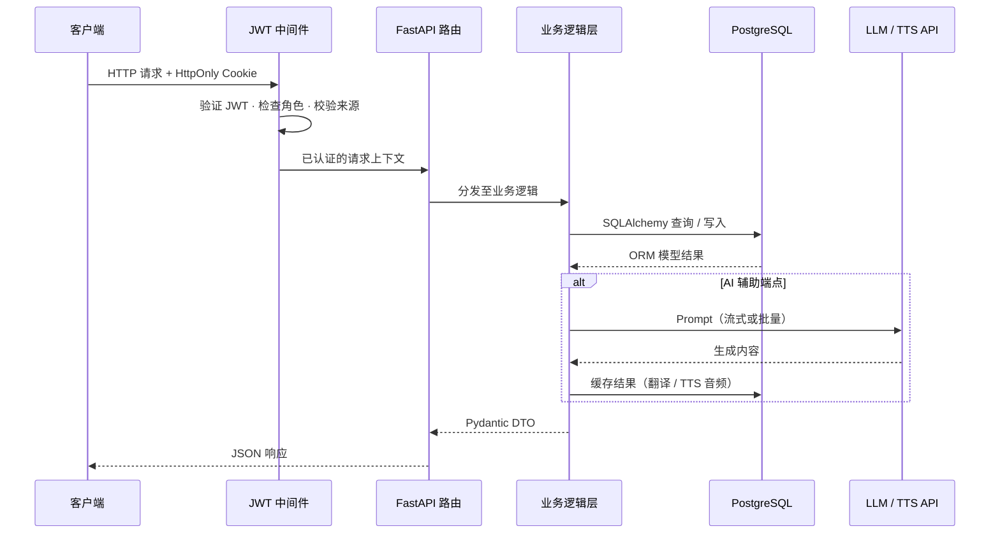

<!-- ╔══════════════════════════════════════════════════════════════╗ -->
<!-- ║                      TOP BANNER                             ║ -->
<!-- ╚══════════════════════════════════════════════════════════════╝ -->
<p align="center">
  
</p>

<!-- ╔══════════════════════════════════════════════════════════════╗ -->
<!-- ║              LANGUAGE SWITCHER + VISITOR BADGE              ║ -->
<!-- ╚══════════════════════════════════════════════════════════════╝ -->
<div align="center">

<a href="./README.md">
  
</a>
&nbsp;&nbsp;


<br /><br />

<!-- ── 项目状态 ──────────────────────────────────────────────── -->


<br />

<!-- ── 工程质量 ──────────────────────────────────────────────── -->


<br />

<!-- ── 社交 ──────────────────────────────────────────────────── -->


</div>

---

## 项目简介

Academy Linker 是一个 **AI 原生校园沟通平台**，旨在消除学校与家庭之间的信息壁垒。相比于向家长展示一堆孤立的数字，它提供的是可操作的上下文信息、多语言无障碍访问，以及覆盖所有角色的人机协同沟通体验。

**项目亮点：**

- **上下文感知 AI 助手** — 悬浮、页面绑定的 AI，理解用户当前正在查看的内容
- **AI 报告生成与翻译** — 基于可配置 LLM 后端的自动摘要生成
- **17 种语言支持** — i18next 语言包 + AI 翻译兜底 + 浏览器自动检测
- **TTS 无障碍** — Gemini 驱动的文字转语音，附带音频缓存层
- **角色隔离体验** — 家长、教师、管理员各有独立专属页面
- **JWT + HttpOnly Cookie 认证** — 刷新令牌流、设备管理、来源校验

---

## 演示账号

> [!NOTE]
> 登录前请先执行：`uv run python -m ac_link.db.seed --scenario full-demo --reset --with-auth-tokens`

<div align="center">

| 角色 | 邮箱 | 密码 |
|:---:|:---|:---:|
| 🔑 **管理员** | `admin.demo@academy-link.dev` | `114514` |
| 👩‍🏫 **教师** | `teacher.ada@academy-link.dev` | `114514` |
| 👩‍🏫 **教师** | `teacher.lin@academy-link.dev` | `114514` |
| 👨‍👩‍👧 **家长** | `parent.chen@academy-link.dev` | `114514` |
| 👨‍👩‍👧 **家长** | `parent.wang@academy-link.dev` | `114514` |

</div>

---

## 截图与预览

> _截图与 GIF 演示即将上线，位置已预留。_

<details>
<summary>📸 展开预览</summary>

<br />

**角色端页面**

| 家长仪表盘 | 教师工作台 | 管理员控制台 |
|:---:|:---:|:---:|
|  |  |  |

**核心交互**

| AI 助手 | 学科详情 | 讨论区 |
|:---:|:---:|:---:|
|  |  |  |

<!--
  添加截图说明：
  1. 将图片文件放入 docs/assets/（PNG/WebP 静态图，GIF 交互录屏）
  2. GIF 录制推荐：Linux 用 Peek，保持 3MB 以内
  3. 浏览器 Mockup：https://shots.so 或 https://www.screely.com
  4. 替换上方路径后删除本注释块
-->

</details>

---

## 核心功能

<table>
<tr>
<td width="33%" valign="top">

### 👨‍👩‍👧 家长端

- 学生仪表盘，含趋势与预警
- 学科级别成绩详情
- AI 生成的报告与摘要
- 与教师的直接消息通道
- 请假申请与不良行为上报
- 全内容 TTS 朗读支持
- 17 种语言阅读支持
- 生日与节假日智能横幅

</td>
<td width="33%" valign="top">

### 👩‍🏫 教师工作台

- 高风险学生可见性看板
- 班级与学生详情视图
- 家长消息工作流
- 公告与班级帖子发布
- 结构化标签管理系统
- 课表管理
- AI 报告草稿辅助

</td>
<td width="33%" valign="top">

### 🏫 管理员控制台

- 全校指标总览
- 教师、班级、学生管理
- 家长-学生绑定管理
- 教学任务分配管理
- 资源与结构管理
- 完整用户生命周期控制

</td>
</tr>
</table>

---

## 技术栈

<div align="center">

**前端**


**后端与数据层**


**工具链与基础设施**


</div>

<br />

<details>
<summary>📦 完整技术栈详情</summary>

<br />

| 层级 | 技术 |
|---|---|
| **前端** | React 19、TypeScript 5、Vite 8、Tailwind CSS 4、React Router DOM 7、Base UI、Lucide React、Geist 字体 |
| **样式** | CSS 变量、`tailwind-merge`、`class-variance-authority`、`clsx`、`tw-animate-css` |
| **国际化与无障碍** | i18next、17 种语言包、浏览器自动检测、语言偏好持久化、主题切换、TTS 朗读 |
| **前端开发体验** | ESLint 9、TypeScript ESLint、React Hooks + Refresh 插件、类型化 API 客户端、`@` 别名导入、Vite 开发代理 |
| **后端** | Python 3.12、FastAPI、Pydantic Settings、Uvicorn |
| **ORM / 数据库** | SQLAlchemy 2、SQLModel、PostgreSQL 16、Psycopg 3、演示数据 Seed 工具包 |
| **认证** | JWT + 刷新令牌流、HttpOnly Cookie Session、CORS 白名单、来源校验、设备登出 |
| **AI 层** | OpenAI Python SDK、可配置 LLM Base URL 与模型、Gemini TTS、TTS 音频缓存、翻译解析 |
| **测试** | pytest、FastAPI TestClient、API 集成测试、Seed 测试数据策略 |
| **基础设施** | Podman + Compose、容器化后端、PostgreSQL 健康检查、GitHub Actions、Nginx、SSH/SCP 部署 |

</details>

---

## 系统架构

<details>
<summary>🏗️ 展开架构图</summary>

### 系统全景图

```mermaid
graph TB
    subgraph Browser["🌐 浏览器"]
        FE["React 19 + Vite\nTypeScript · Tailwind CSS 4\ni18next · 17 语言 · TTS"]
    end

    subgraph Proxy["⚙️ 边缘 / 代理层"]
        PROXY["/api → :8000\nVite 开发代理 · Nginx 生产"]
    end

    subgraph API["🐍 FastAPI — Python 3.12"]
        direction TB
        AUTH["JWT 中间件\nCORS · 来源校验\n基于角色的访问控制"]
        ROUTER["路由层\nparent · teacher · admin · auth"]
        AI_SVC["AI 服务\nOpenAI 兼容 SDK\n可配置模型与 Base URL"]
        TTS_SVC["TTS 服务\nGemini API\n音频缓存层"]
        I18N_SVC["翻译缓存\nresource_translations\n失效感知的缓存策略"]
    end

    subgraph DATA["🗄️ 数据层"]
        PG[("PostgreSQL 16\n22 张表\nSQLModel · SQLAlchemy 2")]
        CACHE[("TTS 音频缓存\n（文件系统）")]
    end

    subgraph EXT["☁️ 外部 AI API"]
        LLM["LLM API\n（可配置端点）"]
        GEMINI["Google Gemini\n（TTS）"]
    end

    FE -->|HTTPS| PROXY -->|反向代理| AUTH
    AUTH --> ROUTER
    ROUTER --> AI_SVC
    ROUTER --> TTS_SVC
    ROUTER --> I18N_SVC
    ROUTER -->|SQLAlchemy 2| PG
    AI_SVC --> LLM
    TTS_SVC --> GEMINI
    TTS_SVC --> CACHE
    I18N_SVC --> LLM
```



### 请求链路图



</details>

---

## 数据库 Schema

```mermaid
erDiagram
    users {
        int id PK
        uuid uuid UK
        string role
        string email UK
        string password_hash
        string display_name
        string phone_number
        bool is_active
        datetime last_login_at
        datetime created_at
        datetime updated_at
    }
    user_settings {
        int id PK
        uuid uuid UK
        int user_id UK
        string language
        string timezone
        string theme
        bool high_contrast_mode
        bool tts_enabled
        bool ai_auto_translate_enabled
        string ai_chat_style
        datetime created_at
        datetime updated_at
    }
    user_sessions {
        int id PK
        uuid uuid UK
        int user_id
        string refresh_token_hash UK
        string device_label
        string ip_address
        datetime expires_at
        datetime last_used_at
        datetime revoked_at
    }
    classes {
        int id PK
        uuid uuid UK
        string name
        string grade_level
        string academic_year
        int homeroom_teacher_user_id
        bool is_active
        datetime created_at
        datetime updated_at
    }
    students {
        int id PK
        uuid uuid UK
        string sid UK
        string full_name
        string preferred_name
        int class_id
        date date_of_birth
        bool is_active
        datetime created_at
        datetime updated_at
    }
    parent_student_bindings {
        int id PK
        uuid uuid UK
        int parent_user_id
        int student_id
        string relationship_label
        bool is_primary
        bool is_active
        datetime created_at
        datetime updated_at
    }
    subjects {
        int id PK
        uuid uuid UK
        string name
        string code UK
        bool is_active
        datetime created_at
        datetime updated_at
    }
    teaching_assignments {
        int id PK
        uuid uuid UK
        int teacher_user_id
        int student_id
        int subject_id
        bool is_active
        datetime created_at
        datetime updated_at
    }
    reports {
        int id PK
        uuid uuid UK
        int student_id
        int subject_id
        int author_user_id
        string report_type
        string source_type
        string title
        string content_markdown
        string original_language
        datetime period_start
        datetime period_end
        datetime published_at
        datetime created_at
        datetime updated_at
    }
    report_user_states {
        int id PK
        uuid uuid UK
        int report_id
        int user_id
        bool is_read
        datetime read_at
        bool is_archived
        datetime archived_at
        datetime created_at
        datetime updated_at
    }
    announcements {
        int id PK
        uuid uuid UK
        int student_id
        int subject_id
        int author_user_id
        string category
        string title
        string content_markdown
        string original_language
        bool is_important
        datetime published_at
        datetime due_at
        datetime created_at
        datetime updated_at
    }
    announcement_user_states {
        int id PK
        uuid uuid UK
        int announcement_id
        int user_id
        bool is_read
        datetime read_at
        datetime created_at
        datetime updated_at
    }
    discussion_threads {
        int id PK
        uuid uuid UK
        int student_id
        int parent_user_id
        int teacher_user_id
        datetime last_post_at
        datetime created_at
        datetime updated_at
    }
    tags {
        int id PK
        uuid uuid UK
        string scope
        string name
        string color
        string description
        int owner_teacher_user_id
        bool is_selectable_by_parent
        bool is_selectable_by_teacher
        bool affects_business_logic
        bool is_active
        datetime created_at
        datetime updated_at
    }
    posts {
        int id PK
        uuid uuid UK
        int thread_id
        int author_user_id
        int reply_to_post_id
        string title
        string content_markdown
        string original_language
        datetime created_at
        datetime updated_at
        datetime deleted_at
    }
    post_tags {
        int id PK
        uuid uuid UK
        int post_id
        int tag_id
        datetime created_at
        datetime updated_at
    }
    thread_user_states {
        int id PK
        uuid uuid UK
        int thread_id
        int user_id
        int last_read_post_id
        datetime last_read_at
        int unread_count_cache
        datetime created_at
        datetime updated_at
    }
    student_exam_scores {
        int id PK
        uuid uuid UK
        int student_id
        int subject_id
        int author_user_id
        string exam_name
        date exam_date
        float score
        float full_score
        string note
        datetime created_at
        datetime updated_at
    }
    student_period_metrics {
        int id PK
        uuid uuid UK
        int student_id
        int subject_id
        int author_user_id
        string term
        float progress
        float assignment_completion_rate
        float attendance_rate
        date snapshot_date
        datetime created_at
        datetime updated_at
    }
    resource_translations {
        int id PK
        uuid uuid UK
        string resource_type
        int resource_id
        string language
        string translated_content_markdown
        string translation_status
        datetime translated_at
        datetime created_at
        datetime updated_at
    }
    ai_conversations {
        int id PK
        uuid uuid UK
        int user_id
        string context_type
        int student_id
        int subject_id
        string title
        bool is_archived
        datetime last_message_at
        datetime archived_at
        datetime created_at
        datetime updated_at
        datetime deleted_at
    }
    ai_messages {
        int id PK
        uuid uuid UK
        int conversation_id
        string role
        string preset
        string content_markdown
        datetime created_at
        datetime deleted_at
    }

    users ||--|| user_settings : "has settings"
    users ||--o{ user_sessions : "has sessions"
    users ||--o{ parent_student_bindings : "parent binds"
    users ||--o{ teaching_assignments : "teaches"
    users ||--o{ reports : "authors"
    users ||--o{ report_user_states : "reads"
    users ||--o{ announcements : "publishes"
    users ||--o{ announcement_user_states : "reads"
    users ||--o{ discussion_threads : "parent in"
    users ||--o{ discussion_threads : "teacher in"
    users ||--o{ posts : "writes"
    users ||--o{ thread_user_states : "tracks"
    users ||--o{ ai_conversations : "owns"
    users ||--o{ tags : "owns private"
    users ||--o{ student_exam_scores : "records"
    users ||--o{ student_period_metrics : "records"
    classes ||--o{ students : "contains"
    classes ||--o| users : "homeroom teacher"
    students ||--o{ parent_student_bindings : "bound"
    students ||--o{ teaching_assignments : "assigned"
    students ||--o{ reports : "subject of"
    students ||--o{ announcements : "target of"
    students ||--o{ discussion_threads : "context"
    students ||--o{ ai_conversations : "context"
    students ||--o{ student_exam_scores : "has"
    students ||--o{ student_period_metrics : "has"
    subjects ||--o{ teaching_assignments : "taught in"
    subjects ||--o{ reports : "scoped to"
    subjects ||--o{ announcements : "scoped to"
    subjects ||--o{ ai_conversations : "context"
    subjects ||--o{ student_exam_scores : "for"
    subjects ||--o{ student_period_metrics : "for"
    reports ||--o{ report_user_states : "has states"
    announcements ||--o{ announcement_user_states : "has states"
    discussion_threads ||--o{ posts : "contains"
    discussion_threads ||--o{ thread_user_states : "has states"
    posts ||--o{ post_tags : "tagged"
    posts ||--o{ posts : "replied to"
    tags ||--o{ post_tags : "applied"
    ai_conversations ||--o{ ai_messages : "contains"
```

<details>
<summary>🗃️ 展开完整 ER 图 — 22 张表</summary>

<br />



</details>

---

## 目录结构

```text
academy-linker/
├── backend/                        # FastAPI 应用、ORM、Seed 工具包、Podman Compose
│   ├── src/ac_link/
│   │   ├── api/                    # 路由处理层（parent · teacher · admin · auth）
│   │   ├── db/                     # SQLModel 表模型与演示数据 Seed 工具包
│   │   └── services/               # 业务逻辑、AI、TTS、翻译缓存
│   ├── compose.yaml                # PostgreSQL + 后端容器定义
│   └── pyproject.toml
├── frontend/                       # React + TypeScript + Vite SPA
│   ├── src/
│   │   ├── screens/                # 基于页面的路由结构
│   │   ├── api/                    # 类型化 API 客户端层
│   │   └── locales/                # 17 种 i18n 语言包
│   └── package.json
├── docs/                           # 需求、路由、API、数据库设计文档
│   ├── requirement_list.md
│   ├── page_router.md
│   └── db_schema_design_v1.md
└── .github/workflows/
    ├── deploy-backend.yml           # 构建前端 → SCP 同步 → SSH 部署
    └── generate-snake.yml          # 每日生成贡献蛇形动画 SVG
```

---

## 快速开始

<details>
<summary>🚀 本地开发环境搭建</summary>

<br />

### 前置依赖

- Node.js 22 · npm
- Python 3.12 · [`uv`](https://docs.astral.sh/uv/)
- Podman（含 `podman compose` 支持）

### 1 · 克隆仓库

```bash
git clone https://github.com/Kscii/academy-linker.git
cd academy-linker
```

### 2 · 配置后端环境变量

```bash
cd backend
cp .env.example .env
```

最低必填变量：

| 变量 | 用途 |
|---|---|
| `POSTGRES_USER` | 数据库用户名 |
| `POSTGRES_PASSWORD` | 数据库密码 |
| `POSTGRES_DB` | 数据库名称 |
| `JWT_SECRET_KEY` | Token 签名密钥 |

AI/TTS 功能可选变量：

| 变量 | 用途 |
|---|---|
| `LLM_API_KEY` | LLM 服务商 API Key |
| `LLM_BASE_URL` | LLM API Base URL（OpenAI 兼容格式） |
| `LLM_MODEL` | 模型标识符 |
| `TTS_API_KEY` | Gemini TTS API Key |

### 3 · 安装后端依赖

```bash
uv sync
```

### 4 · 启动 PostgreSQL

```bash
podman compose up -d postgres
```

### 5 · 写入演示数据

```bash
uv run python -m ac_link.db.seed --scenario full-demo --reset --with-auth-tokens
```

### 6 · 启动后端

```bash
uv run uvicorn ac_link.run:app --reload --host 0.0.0.0 --port 8000 --app-dir src
```

→ `http://localhost:8000`

### 7 · 安装并启动前端

```bash
cd ../frontend
npm install
npm run dev
```

→ `http://localhost:5173`（Vite 自动将 `/api` 代理到 `:8000`）

### 常用命令

```bash
# 后端测试
cd backend && pytest src/ac_link/test/ -v

# 前端 Lint
cd frontend && npm run lint

# 前端生产构建
cd frontend && npm run build

# 停止容器
cd backend && podman compose down
```

</details>

---

## GitHub 统计

<details>
<summary>📊 展开 GitHub 统计</summary>

<div align="center">

<!-- ── 连续提交 ──────────────────────────────────────────────── -->


<br /><br />

<!-- ── 统计卡 + 语言分布 ────────────────────────────────────── -->
<a href="https://github.com/Kscii">
  
  
</a>

<br /><br />

<!-- ── 仓库卡片 ────────────────────────────────────────────── -->
<a href="https://github.com/Kscii/academy-linker">
  
</a>

<br /><br />

<!-- ── 成就奖杯 ────────────────────────────────────────────── -->


<br /><br />

<!-- ── 活跃度图 ────────────────────────────────────────────── -->


<br /><br />

<!-- ── 贡献蛇形动画 ────────────────────────────────────────── -->
<picture>
  <source media="(prefers-color-scheme: dark)" srcset="https://raw.githubusercontent.com/Kscii/academy-linker/output/github-contribution-grid-snake-dark.svg" />
  <source media="(prefers-color-scheme: light)" srcset="https://raw.githubusercontent.com/Kscii/academy-linker/output/github-contribution-grid-snake.svg" />
  
</picture>

</div>

</details>

---

## Star 历史

<div align="center">

[](https://star-history.com/#Kscii/academy-linker&Date)

</div>

---

## 贡献指南

<details>
<summary>📋 协作规则与 PR 检查清单</summary>

<br />

1. 不得直接提交到 `main` 分支。
2. 每次变更（包括小修改）都应创建独立的 feature 分支。
3. 合并前必须先开 Pull Request。
4. 保持 PR 聚焦 — 避免将 schema、UI、基础设施改动混在一个 PR 中，除非它们高度耦合。
5. 行为、路由、schema 或环境变量发生变化时，必须同步更新文档。
6. 请求 Review 前请先运行相关检查。
7. 不得提交密钥、真实 API Key 或生产 `.env` 文件。
8. 涉及数据库 schema 或 API 合约变更时，PR 描述中必须包含迁移/设计说明。

**分支命名规范：** `feat/` · `fix/` · `docs/` · `refactor/`

**PR 提交检查清单：**

- [ ] 本地应用可正常启动
- [ ] 相关测试或 Lint 已通过
- [ ] 文档已按需更新
- [ ] 不包含任何密钥信息
- [ ] 未直接推送至 `main`

</details>

---

## 开源协议

[MIT](./LICENSE)

<!-- ╔══════════════════════════════════════════════════════════════╗ -->
<!-- ║                     BOTTOM BANNER                           ║ -->
<!-- ╚══════════════════════════════════════════════════════════════╝ -->
<p align="center">
  
</p>
